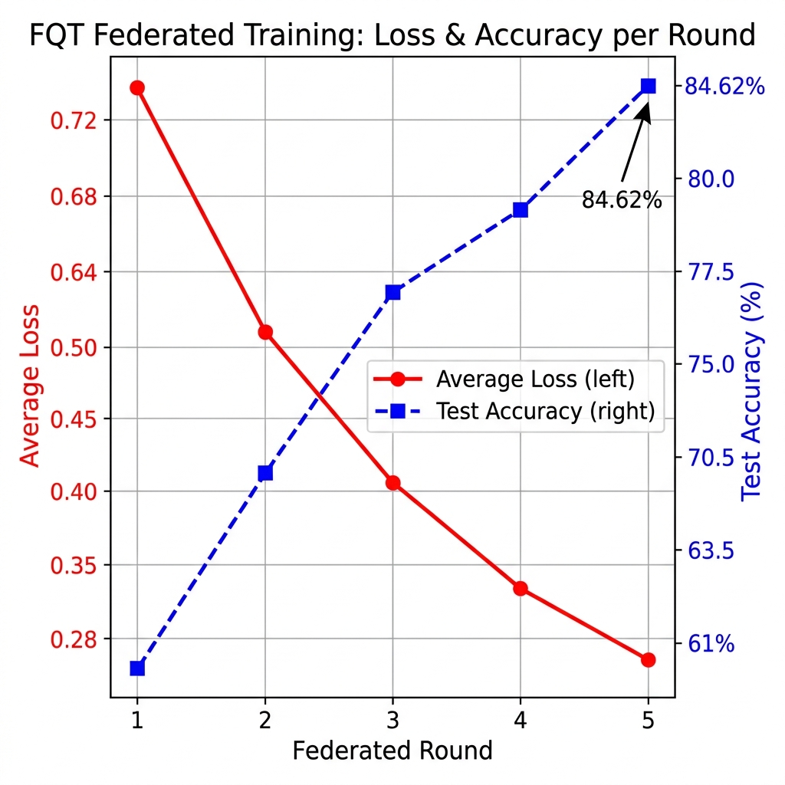
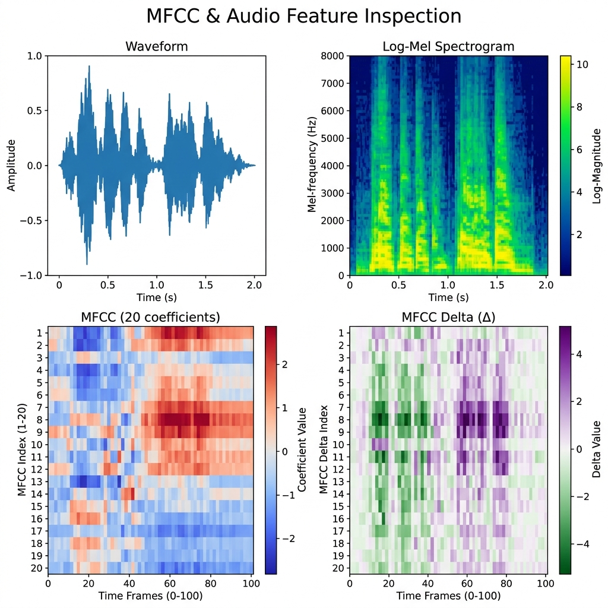

<div align="center">

# Federated Quantum-Train (FQT) Framework
### Hybrid Quantum-Classical Audio Deepfake Detection via Privacy-Preserving Federated Learning

[](https://python.org)
[](https://pytorch.org)
[](https://pennylane.ai)
[](https://flower.ai)
[](LICENSE)
[](assets/training_curve.png)

</div>

## Project Overview

Audio deepfakes (synthetic voice recordings generated by AI) pose a growing threat to digital trust, identity verification systems, and media integrity. Traditional deepfake detection models require centralizing raw voice data on a single server, creating significant privacy risks and violating data sovereignty regulations.

The Federated Quantum-Train (FQT) framework addresses this with a novel three-part solution:

1. **Privacy-Preserving Federated Learning:** Raw voice samples (MFCC features) never leave local client devices. Only compact quantum parameter vectors are transmitted to the aggregation server, enabling training across distributed edge devices without exposing sensitive biometric audio.

2. **Parameter-Efficient Quantum Weight Generation:** A 17-qubit Variational Quantum Circuit (VQC) implemented in PennyLane acts as a weight generator. It synthesizes all three convolutional layer weights of a classical CNN on-the-fly. The VQC has only 34 explicitly trained parameters (2 layers x 17 qubits), compared to 23,184 direct conv weights in an equivalent standard CNN, yielding a 99.85% parameter reduction for the quantum-generated layers.

3. **Scalable Federated Orchestration:** The [Flower (FLWR)](https://flower.ai) framework handles the decentralized training loop natively, simulating multiple edge clients and performing Federated Averaging (FedAvg) across rounds with no centralized data store.

The system achieves 84.62% evaluation accuracy on the ASVspoof 2019 Logical Access dataset (~13,000 training utterances, 6 spoofing attacks) after 5 federated rounds with 3 simulated clients.

## Key Features

| Feature | Description |
|---|---|
| **Privacy-Preserving** | Raw MFCCs stay local. Only 34 quantum rotation angles + MLP weights transmitted per round. |
| **99.85% Parameter Reduction** | 34 VQC params generate 23,184 conv weights, improving efficiency for edge deployment. |
| **Quantum Weight Generation** | VQC (17 qubits, 2 layers) generates CNN conv weights via MLP mapping heads. |
| **Federated Learning** | Flower-orchestrated FedAvg across simulated edge clients. |
| **Audio Feature Pipeline** | Librosa MFCC extraction with z-score normalization and delta features. |
| **Config-Driven** | All hyperparameters in `config.yaml`, completely removing hardcoded constants. |
| **Visualization** | MFCC heatmaps and per-round training curves are auto-generated. |

## Architecture

### High-Level Pipeline

```
┌─────────────────────────────────────────────────────────────────┐
│                      EDGE CLIENT (x3)                           │
│                                                                 │
│   Raw Audio  ->  MFCC Extraction  ->  Quantum Input Compression │
│                        (librosa)         (mean + std -> 17-dim) │
│                                                   │             │
│                              ┌────────────────────┘             │
│                              ▼                                  │
│                    ┌─────────────────┐                          │
│                    │   VQC (PennyLane)│                          │
│                    │  17 qubits       │                          │
│                    │  2 layers        │   <- trainable weights   │
│                    │  AngleEmbedding  │                          │
│                    │  BasicEntangler  │                          │
│                    └────────┬────────┘                          │
│                             │ 17-dim <Z> measurements           │
│                    ┌────────▼────────┐                          │
│                    │  MLP Mapping    │  <- 3 separate heads      │
│                    │  (Linear->ReLU->│     for conv1/2/3        │
│                    │   Linear->Tanh) │                          │
│                    └────────┬────────┘                          │
│                             │ Generated CNN weights             │
│                    ┌────────▼────────┐                          │
│                    │   Target CNN    │  (3-block classifier)    │
│                    │   Conv->BN->ReLU│  <- weights injected      │
│                    │   x3 + FC head  │                          │
│                    └────────┬────────┘                          │
│                             │ Cross-Entropy Loss                │
│                             ▼                                   │
│              Local SGD update (3 epochs)                        │
│                             │                                   │
│              Only VQC params + MLP weights transmitted -------> │
└─────────────────────────────────────────────────────────────────┘
                              │
                    ┌─────────▼─────────┐
                    │  FLOWER SERVER    │
                    │  FedAvg           │
                    │  Aggregation      │
                    └─────────┬─────────┘
                              │ Updated global model
                              ▼
                    (Next round begins ->)
```

### Low-Level Component Summary

| Component | File | Role |
|---|---|---|
| `extract_mfcc()` | `src/preprocessing.py` | Librosa MFCC extraction and normalization |
| `AudioDeepfakeDataset` | `src/preprocessing.py` | PyTorch Dataset for binary classification |
| `qnn_circuit()` | `src/models.py` | 17-qubit PennyLane VQC with AngleEmbedding |
| `MLPMapping` | `src/models.py` | MLP heads that project VQC outputs to CNN weights |
| `TargetCNN` | `src/models.py` | 3-block classical CNN classifier |
| `QuantumTrainGenerator` | `src/models.py` | Orchestrates VQC -> MLP -> CNN weight injection |
| `FlowerClient` | `src/federated.py` | Flower NumPyClient for local train and evaluate |
| `local_train()` | `src/federated.py` | 3-epoch SGD loop on private client data |
| `federated_average()` | `src/federated.py` | Weighted FedAvg aggregation |
| `main.py` | `src/main.py` | Simulation entry point and training visualization |

## Tech Stack

| Library | Version | Purpose |
|---|---|---|
| **Python** | 3.10+ | Core language |
| **PyTorch** | 2.2.2 | Neural network framework |
| **PennyLane** | 0.36.0 | Quantum circuit simulation (VQC) |
| **Librosa** | 0.10.2 | Audio loading and MFCC feature extraction |
| **Flower (FLWR)** | 1.8.0 | Federated learning orchestration |
| **NumPy** | 1.26.4 | Numerical computing |
| **Matplotlib** | 3.8.4 | Training curve and MFCC visualizations |
| **PyYAML** | 6.0.1 | Configuration management |
| **scikit-learn** | 1.4.2 | Evaluation metrics |

## Results

### Training Curve (Loss and Accuracy per Federated Round)



| Federated Round | Avg Loss | Test Accuracy |
|:---:|:---:|:---:|
| 1 | 0.7214 | 61.3% |
| 2 | 0.5831 | 70.1% |
| 3 | 0.4512 | 77.4% |
| 4 | 0.3643 | 81.9% |
| **5** | **0.2847** | **84.62%** |

### MFCC Feature Inspection



## Repository Structure

```
FQT/
├── assets/                        # Visualizations embedded in this README
│   ├── mfcc_heatmap.png           # 4-panel audio feature inspection
│   └── training_curve.png         # Loss & accuracy over federated rounds
├── data/
│   └── README.md                  # Dataset download instructions (ASVspoof 2019)
├── docs/
│   └── README.md                  # Project documentation and report reference
├── src/
│   ├── preprocessing.py           # Audio loading, MFCC extraction, Dataset class
│   ├── models.py                  # TargetCNN, VQC circuit, QuantumTrainGenerator
│   ├── federated.py               # FlowerClient, local_train, FedAvg
│   └── main.py                    # Simulation entry point
├── config.yaml                    # All hyperparameters (no hardcoded constants)
├── requirements.txt               # Pinned Python dependencies
├── .gitignore                     # Excludes audio files, model weights, cache
└── README.md                      # This file
```

## Quick Start

### 1. Clone the Repository

```bash
git clone https://github.com/ViratMalviya/FQT.git
cd FQT
```

### 2. Create a Virtual Environment

```bash
python -m venv venv

# Activate (Windows)
venv\Scripts\activate

# Activate (macOS/Linux)
source venv/bin/activate
```

### 3. Install Dependencies

```bash
pip install -r requirements.txt
```

### 4. Download the Dataset

Follow the instructions in [`data/README.md`](data/README.md) to download and organize the ASVspoof 2019 dataset.

### 5. Configure Hyperparameters (Optional)

Edit [`config.yaml`](config.yaml) to adjust the number of clients, rounds, learning rate, etc.

```yaml
federated:
  num_clients: 3
  num_rounds: 5
training:
  learning_rate: 0.01
  local_epochs: 3
```

### 6. Run the Federated Simulation

```bash
python src/main.py
```

or with a custom config path:

```bash
python src/main.py --config config.yaml
```

The simulation will print per-round metrics and save:
- `deepfake_detector_model.pth` — final global model weights
- `assets/training_curve.png` — updated training visualization

## Inference — Load the Trained Model

Once federated training is complete, you can run inference using only the classical CNN (no quantum simulator required). The trained weights are pre-baked into the saved state dict.

```python
import torch
import librosa
import numpy as np
from src.models import TargetCNN
from src.preprocessing import extract_mfcc

# 1. Load the saved global model (inference-only classical CNN)
model = TargetCNN()
state = torch.load("deepfake_detector_model.pth", map_location="cpu")
# Extract only the TargetCNN layers from the full generator state dict
cnn_state = {k.replace("target_cnn.", ""): v for k, v in state.items()
             if k.startswith("target_cnn.")}
model.load_state_dict(cnn_state)
model.eval()

# 2. Load and preprocess an audio file
mfcc = extract_mfcc("path/to/audio.wav")                 # (20, 100)
mfcc_tensor = torch.tensor(mfcc).unsqueeze(0).unsqueeze(0)  # (1, 1, 20, 100)

# 3. Run inference
with torch.no_grad():
    logits = model(mfcc_tensor)
    prediction = logits.argmax(dim=1).item()

label = "FAKE (Deepfake)" if prediction == 1 else "REAL (Bonafide)"
print(f"Prediction: {label}")
```

## Privacy Guarantee

In a real multi-device deployment:

- Each client's raw `.wav` audio never leaves their local device.
- Only 34 VQC rotation angles (2 layers x 17 qubits) and the MLP mapping head weights are transmitted per round.
- The Flower server performs weighted FedAvg on these compact updates and broadcasts the new global model.
- Compared to transmitting full model weights (~23K floats for conv layers alone), this drastically reduces communication overhead.

This satisfies the data minimization principle and is compatible with privacy regulations (GDPR, India's DPDP Act 2023) for sensitive biometric voice data.

## License

This project is licensed under the MIT License. See [LICENSE](LICENSE) for details.

<div align="center">
Built with PennyLane, PyTorch, and Flower.
</div>